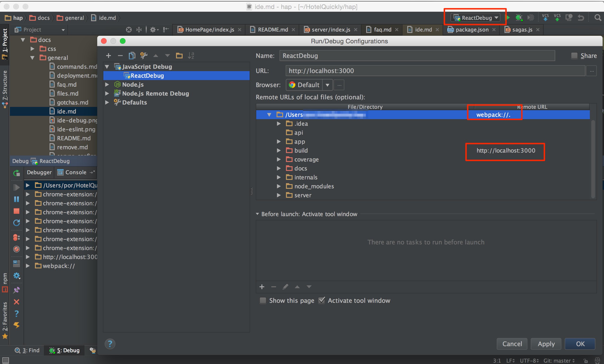
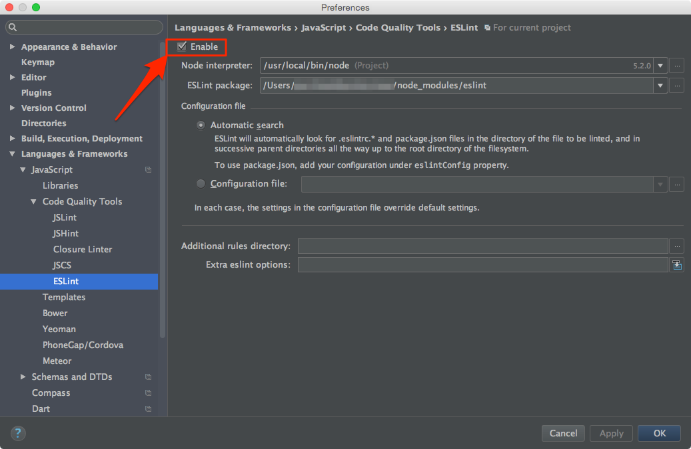

# Debugging

- [Debugging with Visual Studio Code](#debugging-with-visual-studio-code)
- [Debugging with WebStorm](#debugging-with-webstorm)
  - [Troubleshooting](#troubleshooting)
  - [Enable ESLint](#enable-eslint)

## Debugging with Visual Studio Code

You can super charge your React debugging workflow via VS Code and Chrome. Here
are the steps:

1. Install the
   [Debugger for Chrome](https://marketplace.visualstudio.com/items?itemName=msjsdiag.debugger-for-chrome)
   extension in VS Code.
2. Add the `Launch Chrome` option to your `launch.json` config:

```json
{
  "version": "0.2.0",
  "configurations": [
    {
      "type": "chrome",
      "request": "launch",
      "name": "Launch Chrome",
      "url": "http://localhost:3000",
      "webRoot": "${workspaceRoot}/app",
      "sourceMapPathOverrides": {
        "webpack:///./app/*": "${webRoot}/*",
        "webpack:///app/*": "${webRoot}/*"
      }
    }
  ]
}
```

3. Start your dev server with `npm run start`.
4. Launch the VS Code Debugger with the `Launch Chrome` configuration.

You can then set breakpoints directly from inside VS Code, use stepping with the
Chrome or VS Code buttons and more.

Read all about it in the
[Debugger for Chrome page](https://marketplace.visualstudio.com/items?itemName=msjsdiag.debugger-for-chrome).

**Note**: There's currently a
[known problem](https://github.com/react-boilerplate/react-boilerplate/pull/1698)
with source maps and VS Code. You can change your Webpack dev config to use
`inline-source-map` instead of `eval-source-map` and the issue should be
resolved.

## Debugging with WebStorm

WebStorm is a powerful IDE, and why not also use it as debugger tool? Here are
the steps:

1.  [Install JetBrain Chrome Extension](https://chrome.google.com/webstore/detail/jetbrains-ide-support/hmhgeddbohgjknpmjagkdomcpobmllji)
2.  [Setting up the PORT](https://www.jetbrains.com/help/webstorm/2016.1/using-jetbrains-chrome-extension.html)
3.  Change WebPack devtool config to `source-map`
    [(This line)](https://github.com/react-boilerplate/react-boilerplate/blob/56eb5a0ec4aa691169ef427f3a0122fde5a5aa24/internals/webpack/webpack.dev.babel.js#L65)
4.  Run web server (`npm run start`)
5.  Create Run Configuration (Run > Edit Configurations)
6.  Add new `JavaScript Debug`
7.  Setting up URL
8.  Start Debug (Click the green bug button)
9.  Edit Run Configuration Again
10. Mapping Url as below picture
    - Map your `root` directory with `webpack://.` (please note the last dot)
    - Map your `build` directory with your root path (e.g.
      `http://localhost:3000`)
11. Hit OK and restart debugging session



### Troubleshooting

1.  You miss the last `.` (dot) in `webpack://.`
2.  The port debugger is listening tool and the JetBrain extension is mismatch.

### Enable ESLint

ESLint helps developers on a team follow the same coding format. It's highly
recommended to set it up in your IDE to avoid failing the linting step in tests.

1.  Go to WebStorm Preferences
2.  Search for `ESLint`
3.  Click `Enable`


